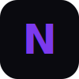

<p align="center">
  
</p>

<h1 align="center">Nexus — Landing Page</h1>

<p align="center">
  
  
  
  
  
  
</p>

<p align="center">
  Landing page moderna con efectos 3D interactivos, animaciones suaves al scroll y diseño glass-morphism. Construida con <strong>Astro</strong> + <strong>Three.js</strong> + <strong>GSAP</strong>.
</p>

---

## Vista previa

| Hero | Features | Plans |
|------|----------|-------|
| Partículas 3D con mouse tracking, gradientes animados | Reveal cards con stagger, glass-morphism | Pricing cards con botón hundido 3D |

> Corre en **http://localhost:4321** tras `npm run dev`

---

## Stack

| Tecnología | Uso |
|------------|-----|
| [Astro](https://astro.build) | SSG, zero JS por defecto, islas |
| [Three.js](https://threejs.org) | Fondo 3D con partículas, torus knots, orbes |
| [GSAP](https://gsap.com) + ScrollTrigger | Reveals, parallax, contadores animados |
| CSS Custom Properties | Design system, glass-morphism, temas |

---

## Estructura

```
src/
├── layouts/
│   └── BaseLayout.astro    # Layout con SEO + PWA
├── pages/
│   ├── index.astro         # Landing principal
│   └── 404.astro           # Página de error
├── styles/
│   └── global.css          # Estilos globales
└── env.d.ts
public/
├── favicon.svg
├── manifest.json           # PWA manifest
├── sw.js                   # Service Worker
└── robots.txt
```

---

## Instalación

```bash
git clone https://github.com/cmperaltarivas/landing-nexus.git
cd landing-nexus
npm install
npm run dev
```

Abre `http://localhost:4321`.

---

## Comandos

| Comando | Descripción |
|---------|-------------|
| `npm run dev` | Servidor de desarrollo |
| `npm run build` | Build estático → `dist/` |
| `npm run preview` | Previsualizar build |

---

## Características

- **Fondo 3D** — 400 partículas + torus knots wireframe + orbes flotantes que reaccionan al mouse
- **Animaciones scroll** — Reveals, parallax, contadores animados (GSAP ScrollTrigger)
- **Glass-morphism** — Cartas con backdrop-blur, bordes translúcidos
- **Navbar flotante** — Píldora centrada con botones efecto hundido 3D
- **Secciones**: Hero, Features, Stats, Plans (pricing), CTA
- **PWA** — Manifest, Service Worker con cache-first, instalable
- **Accesibilidad** — Skip link, roles ARIA, `prefers-reduced-motion` (desactiva animaciones y 3D)
- **SEO** — Open Graph, Twitter Cards, canonical, meta tags
- **Modo oscuro nativo** — Diseño dark-only optimizado

---

## Deploy

### Vercel (recomendado)

[](https://vercel.com/new)

```bash
npm i -g vercel
vercel
```

### Netlify

Arrastra la carpeta `dist/` a Netlify o conecta el repo. Build command: `npm run build`, publish dir: `dist`.

### GitHub Pages

```bash
npm run build
# Sube dist/ a la rama gh-pages
```

---

## Licencia

MIT
